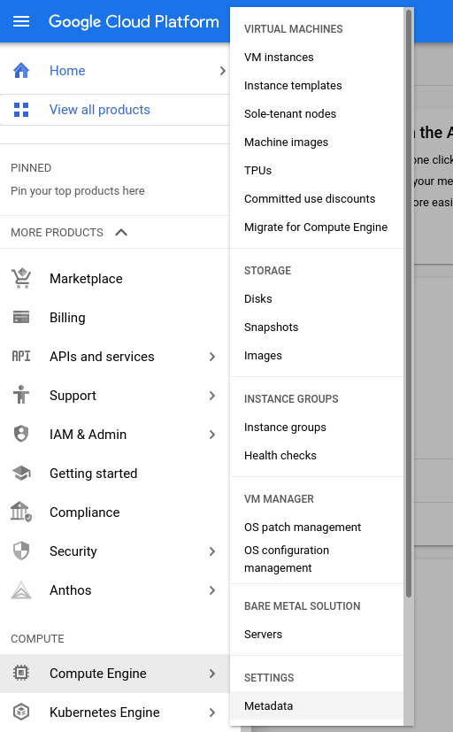
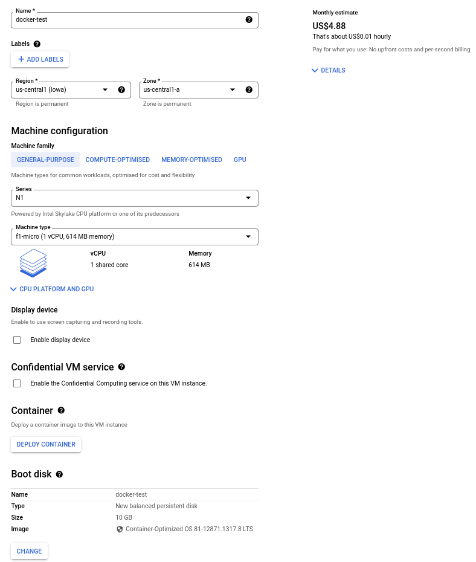
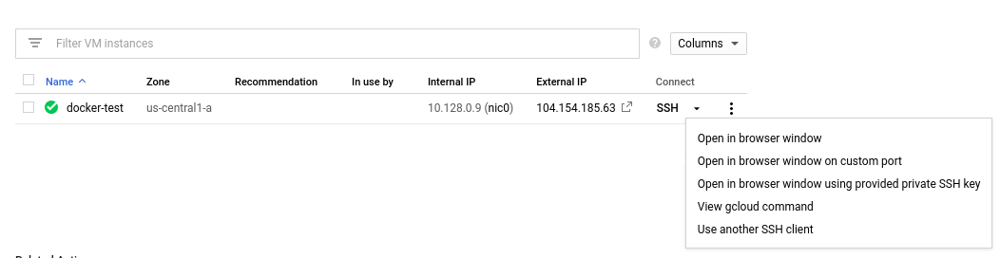
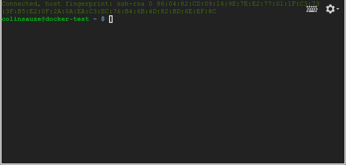
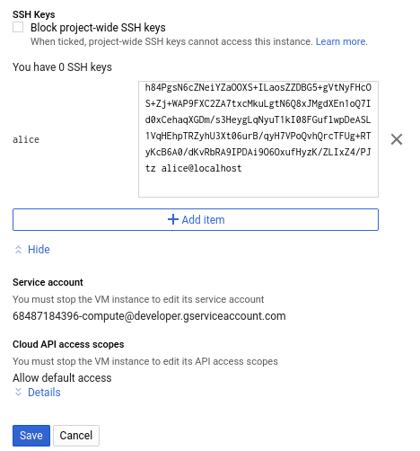
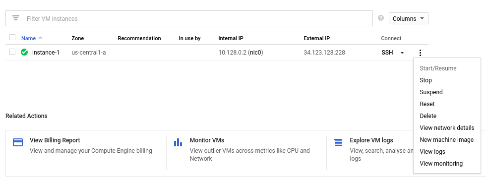
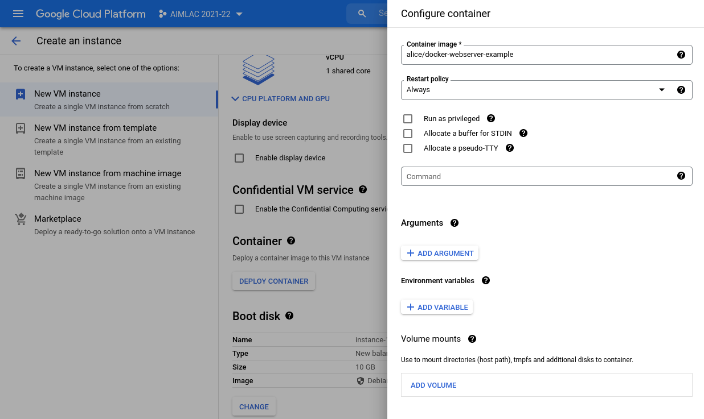
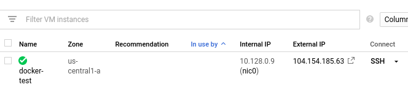
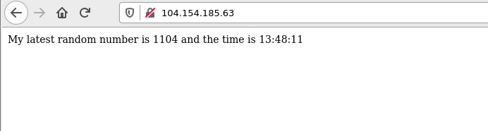

# Creating Containers on Cloud Platforms
There are lots of ways containers can be run on cloud computing platforms (a.k.a., "in the cloud"). Most commercial cloud providers now offer a container hosting service that will connect to the Docker Hub (and their own container registries) in order to fetch the container images that you specify, and charge for the time and resources that the containers use.

## Free and Introductory Offer Container Hosting Options 

Please note these options can be constantly changing, check with the Cloud providers webpage for the latest details. Beware that many of the free trials require you to give payment information and you will be billed at the end of the trial or if you exceed the free trial limits. Many of the cloud providers offer charge limit options, set these to ensure you don't get an sudden large bill. 

## Educational Credits
For this lesson (run by AIMLAC CDT, January 2021) we have received free credit from Google for $50 per student, you will not need to register a credit card to use this. You will have each been emailed a link to activate this.



## Using Containers with Google Cloud

$300 free credit for 3 months when you signup and give credit card details. Free f1-micro VM with 1 shared CPU, 600 MB of RAM and 10GB disk. Free 50 hours per month of Cloud Run time which launches containers to handle web requests. 
https://cloud.google.com/free

## Microsoft Azure
$100 free credit for students signing up via the Github student pack. 
https://education.github.com/pack?sort=popularity&tag=Cloud

$200 free trial for 30 days. 12 months free B1S virtual machine.
https://azure.microsoft.com/en-gb/offers/ms-azr-0044p/

## Amazon Web Services
750 hours per month free t2.micro or t3.micro virtual machine for the first 12 months.
https://aws.amazon.com/free/

## Digital Ocean 
$100 free credit for students signing up via the Github student pack.
https://education.github.com/pack?sort=popularity&tag=Cloud



## Running a container in the cloud, using your Google account

### Setting up your account

- Click the link you've been sent to activate your Google Cloud credit. This should create a billing account using the credit you've been given. 
- Open a web browser window and visit <https://console.cloud.google.com/>.
- Log into your Google account if required.
- Create a new project called AIMLAC and link it to the billing account you just created. Be especially careful if you already use Google Cloud personally that you are billing the right account.

### Creating a virtual machine
- Click on the grill menu, Compute Engine, VM Instances

- Click on "Create Instance" on the page showing the list of current instances.
- Give your VM a name, as we won't need much processing power choose f1-micro as the Machine type by selecting the N1 Series.
- Change the operating system to the Container Optimised OS

### SSH into your container from the Google Cloud Console

- Click on the SSH option under the connect column in the VM Instances page and choose "Open in browser Window."

- From here you can run docker commands and launch the container as you've previously done by typing:

~~~
$ docker run -it alice/alpine-python
~~~
{: .language-bash}

When using the `docker run` command (as you have done previously), the container takes some default actions after being created, which are specified in your Dockerfile (e.g., the `CMD` line).

### SSH into your container from your computer's SSH client

If you want to SSH into your Google Cloud virtual machine from your computer's SSH client instead of the web interface you'll need to generate an SSH key and add it to the virtual machine.

If you've never done this before generate an SSH key with the ssh-keygen command in your terminal.

~~~
$ ssh-keygen
~~~
{: .language-bash}

This will create two files in the .ssh directory inside your home directory. One called id_rsa and the other id_rsa.pub. These form the public and private halves of an encryption key, you need to place the public half on any systems you want to login to.
Display the contents of the id_rsa.pub file and copy it to the clipboard. Then from the Compute Engine VM Instances page do the following:

- Click on the instance name
- Click edit on the top of the screen
- Scroll down to the bottom of the page and find the "SSH keys" section, it will say "You have 0 SSH keys".
- Click on the "Show and edit" link.
- Paste in your public key into the box saying "Enter public SSH key"
- Scroll down and click Save

- Return to the VM Instances page
- Note the external IP address of your virtual machine (104.154.185.63 in the screenshot above, your's will be something different)
- Open a terminal and type ssh followed by a space and the external IP address.
- You should be logged in automatically to your virtual machine without being asked for a password.
- Note that your username will be the same as the username which you use on your computer and which was specified in the key file.

### Destroying your virtual machine 

- From the VM Instances page click the 3 vertical dots at the end of line for your VM.
- Choose "Delete"
- Confirm the deletion
- Your VM and any associated disks will be deleted

### Running a web server container from Google Cloud

Now lets create a new Dockerfile which defines a container based on the nginx webserver. Create a directory called docker-webserver-example and `cd` into it.

~~~
mkdir docker-webserver-example
cd docker-webserver-example
~~~
{: .bash}

Open up a text editor for a new `Dockerfile` and type/paste in the following:

~~~
FROM nginx
MAINTAINER your@email.address

COPY startup.sh /

RUN apt update
RUN apt -y install procps
RUN chmod 777 /startup.sh

#expose the web server port to outside the container
EXPOSE 80/tcp

ENTRYPOINT ["bash","/startup.sh"]
~~~

In the same directory create another file and call it `startup.sh` and type/paste in the following code. This code will start the nginx web server and then every second it will update index.html (the default webpage) with the current time and a random number.

~~~
#!/bin/bash

nginx

#loop forever 
while [ "0" = "0" ] ; do
    time=$(date +%H:%M:%S) 

    echo "My latest random number is $RANDOM and the time is $time" > /usr/share/nginx/html/index.html
    sleep 1
done
~~~
{: .language-bash}

Now build the container we've just specified 

~~~
docker build -t alice/docker-webserver-example .
~~~
{: .language-bash}

Now lets push it to Docker Hub:

~~~
docker push alice/docker-webserver-example
~~~
{: .language-bash}

Go back to the Cloud console's VM Instances page and do the following:

- Click on "Create Instance" on the page showing the list of current instances.
- Give your VM a name, as we won't need much processing power choose f1-micro as the Machine type by selecting the N1 Series.
- Tick the option "Deploy a container image to this VM instance".
- Enter the path to container on Docker Hub which runs a webserver (in this case alice/docker-webserver-example) in the "Container image" box.
- Scrolldown and tick "Allow HTTP traffic" at the bottom of the page under Firewall

- Click create

- Go back to the VM Instances page in the Google Cloud Console and click on the link to the external IP address (104.154.185.63 in this example) or type this address into a new tab/window of your web browser.

- You should see a webpage giving the time and a random number.

- Don't forget to delete the instance when you are done with it.




<!--  LocalWords:  keypoints links.md endcomment Dockerfile
 -->

<!--  LocalWords:  bitbucket-pipelines.yml
 -->
